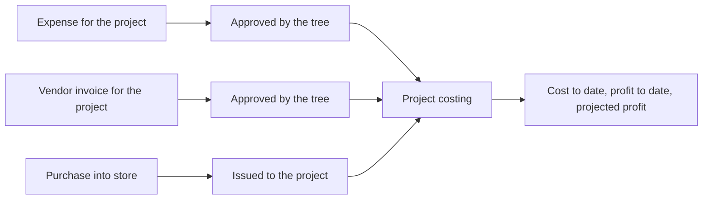

# Encore ERP: Features and Workflows

Living document. A shareable copy with a diagram is kept in Claude Docs: https://claude.ai/code/artifact/250b236f-9c23-48ce-adbf-aee6e1b1c95c

## Overview

Encore ERP is one web app for company money, projects and stock. Expenses, Treasury, Clients, Vendors, Projects, Store and Users share the same people, roles and approval rules.

- **Built on:** Angular 18 with the Fuse admin template, Angular Material and Tailwind. Colours, logo, tables and the sidebar come from the Theme settings.
- **Who uses it:** employees enter expenses and fund requests; managers and accountants approve and pay; admins set up roles, categories and the theme; clients, vendors and customers get their own limited logins.
- **Sign in:** every user lands on the Dashboard (a coming-soon page) and then uses the side menu.
- **Demo mode:** there is no server yet. Data is kept in the browser tab and resets on reload. Only the theme, roles, users, notification read-state, profile photos and share links are remembered in this browser.
- **Acting as:** a picker at the top of most pages lets you test the app as any user. It stands in for real sign-in.

## People and access

What a person sees and can do is decided only by the permissions of their roles. One person can hold several roles and gets the sum of them.

**Roles.** Seeded: Admin (built in, always everything), Accountant, Manager, Data entry executive, Employee, Client, Customer, Vendor. Admins create, rename and delete roles in Configuration > Roles and permissions. A role in use cannot be deleted.

**Permissions.** Each feature has a group named `feature.action` (view, view all, add, edit, delete, approve, pay, export and more). Groups: Fund requests, Organization funds, Transactions, Categories, Company, Theme, Roles, Approval tree, Clients, Vendors, Projects, Store, Users, Expenses, Notifications. The Permissions tab is a matrix of roles against permissions.

**Approval tree.** Requests are approved in steps chosen by amount. Seeded branches:

| Amount (BDT) | Steps in order |
| --- | --- |
| Below 20,000 | Accountant |
| 20,000 to 99,999 | Manager, Accountant |
| 100,000 and above | Manager, Accountant, Admin |

A request copies its path when submitted. Only someone holding the current step's role (with the approve permission), or the "approve any step" permission, can act; the last step approves it. Branches and steps are edited in the Approval tree tab. It drives fund requests, vendor invoices and expenses.

**Safeguards.** Someone active must always keep a role that can assign roles. You cannot delete or deactivate the user you are acting as.

**Users menu.** Employees (HR details, salary, financial records, promotion and history), Admins, Vendors, Clients and Customers. Salary information needs the View salary permission.

**Edit employee.** A wide drawer with a header card (photo or initials, name, designation, ID and an Active switch) and four tabs:

- **Profile:** name, email and phone. A name already used on fund requests is locked.
- **Work:** designation, employee ID, employment type, joining date, department, shift, workstation, and "Where they sit": company, branch, department and team, with the choice narrowing at each level and the result shown as one line (for example "Head Office / Sales").
- **Salary** (needs View salary): gross and its components with a live check that they add up, funds kept from pay, and switches for tax and overtime.
- **Access:** password, the app-login and ID-card switches, and one switch row per role.

**Financial records.** Open from an employee's action menu (needs View salary). A wide drawer with the person, four summary numbers (lifetime earnings, held in funds, taken on fund requests, still to settle) and three tabs:

- **Overview:** earnings (salary and bonus), fund request money taken and given back, and the latest five transactions.
- **Transactions:** the lifetime list, newest first: salary, bonus, security and provident deposits and refunds, fund request payments, money returned and promotions. Narrow it by type or search it. Totals show received (green), returned (red) and kept in funds (blue).
- **Funds:** security and provident balance, total withdrawn, a refund box (never above the balance) and each fund's own movements.

The header has Download / Share: the whole lifetime statement as Excel or PDF, or a share link (needs the Users Export permission). The download always covers every entry, whatever the list is filtered to. Salary, bonus and fund deposits are demo records created with the employee; fund request money and returns come from the Funds feature; a refund adds a line at once.

**Profile.** Opens from the sidebar card or the top-right menu: roles, what you can do, approvals waiting for you, where you approve, and editable job title, phone, about text and photo.

**Notifications.** The bell lists approvals waiting for you first, then actions on requests. Admins see every action; people with the employee-actions permission see what employees did; everyone sees what others did on their own requests.

## Treasury

Treasury holds the company's money (Organization Funds), the requests employees make against it (Funds) and the record of every payment (Transactions).

**Organization Funds.** Cash, bank and other funds with a balance, reserved amount and minimum balance; low funds are flagged. Balance tiles, a trend chart, recent activity, category filters, Excel and PDF export. Categories are managed in Configuration > Categories.

**Funds (requests).** An employee submits a request with purpose, category, amount, needed-by date, work order and an optional attachment. Company, branch, department and currency come from the user's profile.

1. Employee submits; the request follows the approval tree for its amount.
2. Approvers approve step by step (the last step sets the approved amount) or reject with a reason.
3. Accounts record one or more payments, each taken from a fund of the chosen category. A payment cannot exceed the remaining approved amount or the fund's available balance.
4. The employee can give unused money back; Accounts confirm it into a fund or reject it.
5. Employee or admin can close a partly paid request; the unpaid rest is released.

Employees see a wallet of what they have received. Accountants and admins see every request; employees see their own.

**Transactions.** Tabs: Transactions (payments), Returns, Actions, and Treasury movements (admin only). Each can be filtered by dates, downloaded as Excel or PDF, or shared as an online link.

## Expenses

Expenses is where most daily data is entered. Every cost is recorded in a category, approved by amount, then paid.

**Categories.** Managed in Configuration > Categories > Expense categories. 18 are seeded. Each has a type that decides the extra fields:

| Type | Extra details asked |
| --- | --- |
| General cost | Description and who was paid |
| Purchase of goods | Item lines (name, quantity, unit, cost); amount is the sum |
| Vendor payment | Vendor, bill number; checked against what is owed |
| Transport | From, to, mode, traveller, distance |
| Food | Number of people, occasion |
| Rent | Property, month, landlord |
| Promotion | Campaign, channel |

**Entering.** The quick-entry bar takes date, category, amount and a few words; Enter saves and readies the next. The full form adds payee, vendor, project, branch, payment method and receipt photos. People without View all see only their own entries.

**Approval.** Expenses up to the no-approval limit (BDT 5,000, changeable in Expenses > Settings) are approved on entry. Larger ones follow the approval tree. The creator can edit or delete one that is waiting or rejected.

**Payment.** A separate step by someone with the pay permission. It can take money from an Organization Fund (balance checked, a disbursement recorded). A payment to a vendor also lowers what is owed to that vendor and is refused if it exceeds what is due.

**Links.**

- Projects: approved expenses linked to a project count in its costing (vendor payments are left out because the cost arrives through vendor invoices).
- Store: an approved purchase with item lines can be received into a store, and its items join the product list automatically.
- Price history: item prices feed each product's price history, and the form shows the last, lowest and average price.

## Clients, Vendors and Customers

**Clients.** Full company details. Tabs: Overview, Projects (read-only list with updates), Documents and Portal access.

- Documents: requirements, purchase orders, work orders, bills and delivery challans. Staff add company documents; a client login can send its own and delete only those.
- Sharing: a document or project can be shared as a read-only link (1, 7, 30 days or never), copied or opened in the email app.
- Portal access: link a user or create a client login; a linked user sees only that client.

**Vendors.** Types: product vendor, service vendor, other.

| Tab | Who sees it | What it holds |
| --- | --- | --- |
| Products | Product vendors | Price list the vendor keeps |
| Purchase orders | Product vendors | Orders sent, with items and project |
| Invoices | All | Invoice with a photo or scan; approved through the approval tree |
| Payments | All | Transactions, due payment requests, record payment |
| History | All | Timeline of orders, invoices, payments, requests |
| Daily reports | Service vendors | Coming soon |

Money summary: total invoiced (approved invoices), total paid, due now, requested. A vendor login can submit invoices and request a due payment up to what is due and not already requested; staff accept or decline with a reason.

**Customers.** A customer login has the Customer role, no company link and no permissions yet.

## Projects

A project ties a client's contract to its budget, team, costs and profit. Profit is worked out automatically.

**Fields.** Client, name, type (supply, service or both), manager, branch, vendors, location, work order, dates, description. Money: contract value, budget, and payment terms (advance with a percentage and amount received, or credit with days). A service project needs a branch or a vendor; a work order cannot be used twice.

**Tabs.** Overview, Costing and profit (needs View costing), Store, Updates.

**Where cost comes from.**

| Source | Counted when |
| --- | --- |
| Expense | A paid fund request names the work order (minus money returned), or an approved Expenses entry is linked to the project |
| Vendor purchase | An approved vendor invoice is linked to the project, directly or through its purchase order |
| Store issue | Stock is issued from a store to the project, at average cost |

Goods bought into a store are counted when issued, not when bought, so money is never counted twice.

**Profit figures.** Earned so far = contract value x progress. Profit to date = earned minus cost to date. Projected profit = contract value minus the larger of budget and cost to date. Budget used = cost to date as a share of budget.

## Store

Office and project stores, a product catalogue and a ledger of every movement. Stock is worked out from the ledger, never typed in.

| Kind | Meaning | Rules |
| --- | --- | --- |
| Consumable | Used up when issued | Can be issued |
| Asset | Kept and reused | Transfer only; cannot be issued |
| Supply item | Goods sold or handed to a client | Can be issued to a project |

**Actions.** Receive (from an expense, a vendor purchase order or by hand), Issue (to a project or office use), Transfer (between stores) and Count (correct the stock with a reason). Value uses a running average cost per store; cost columns need View cost.

**Automatic product list.** Items of an approved product or parts purchase that are not in the catalogue are added automatically (parts as consumables under Spare parts, others as supply items), tagged "New from EX-...".

**Price history.** Per product: every price paid from approved purchase expenses, vendor purchase orders and hand receipts; last, average, lowest and highest price, a chart, a table with suppliers, and vendors' current price lists.

## Configuration

- **Categories:** one page, a section per feature (Organization funds, Fund requests, Store items, Expense categories), with chips to jump between them. A category in use cannot be deleted; renames follow through.
- **Theme:** colours, logo, page background, sidebar colour and glass wallpaper, table design. Previewed until saved.
- **Company:** see below.
- **Roles and permissions:** Roles, Permissions matrix, Employees (several roles per person) and Approval tree.
- **Menu and routes:** every item and page is guarded by a permission; a person without access goes back to the Dashboard.

### Company structure

Configuration > Company defines how the organisation is built. Every other feature points at this structure.

```
Company  (Encore Engineering Ltd)
 ├─ Branch      (Head Office, Chattogram Branch, Dhaka Site)
 │   ├─ Department  (Accounts, Procurement, Sales ...)
 │   │   └─ Team        (Field crew, Estimation team)
 │   └─ Warehouse   (a store of the Store feature)
```

- **Company list:** a card per company with branch, department, warehouse and people counts, search and an Active filter. Add company takes legal name, trade licence, TIN/BIN, address, phone, email, currency and the month the fiscal year starts.
- **Company page tabs:** Overview (details and counts); Structure (an expandable tree; select a unit to see its head, address, notes and people and to add under it, edit, deactivate or delete); Warehouses (stores placed under a branch, each with a manager; add and edit here); People (employees placed in the company and where); Costs (needs the View costs permission).
- **Warehouses are the Store's stores.** There is one list. A warehouse created here appears in Store, and the other way round once it is given a branch.
- **Placing people.** Users > Employees > Work sets company, branch, department and team.
- **Charging costs.** The expense form and the fund request form have a Charged to picker (branch, then department). It defaults to where the acting user sits. Older records that only carry a branch name are matched by that name. The Expenses list can be filtered by branch or department; a branch filter includes its departments.
- **Costs tab.** For a chosen period (this month, last 30 days, this year, all time): approved expenses plus money released on fund requests less what was returned, per branch with its departments under it. A department's cost also counts in its branch. Costs charged to no branch appear in a separate row.
- **Rules.** Codes are unique within a level; a name cannot repeat under the same parent; a unit cannot be moved under itself. A unit that has children, people or warehouses cannot be deleted; deactivate it (this also deactivates everything under it and hides it from the pickers).
- **Permissions (group "Company"):** View, Create, Edit, Delete and View costs.

## Screen conventions

- **Selects:** every drop-down in the app shares one style, defined once in `src/styles/_app-theme.scss`.
- **Switches:** on/off choices (Active, tax applicable, a role on a person, a permission on a role) use the shared switch component, `treasury-switch`, which works with `ngModel` or with `[checked]` and `(toggled)`.
- **Drawers:** add and edit screens open in a right-hand drawer; long forms use the wide drawer.
- **Export:** list and record screens offer Download / Share (Excel, PDF or Word depending on the screen) and an online share link.

## Help

The Help item at the bottom of the menu opens step-by-step guides with screenshots: 26 guides in all, covering every feature flow. Pick who you are (employee, data entry, accountant, manager, admin, client, vendor, customer; it starts as the acting user's role), filter by feature or search, then open a guide. A guide has a short summary, when you would use it, numbered screenshots with red pointers (hover or focus a step to highlight its spot; click a picture to enlarge it), tips, related guides and a Try it now link.

The guides are data (`src/app/modules/admin/help/help-guides.json`) and the screenshots are captured from the running app, so they can be refreshed after the screens change:

1. Start the app: `npx ng serve --port 4300`.
2. Run `node tools/help-capture.js` (all guides) or `node tools/help-capture.js <guide-id>` (one guide). It signs in, acts as the person named in each shot, saves the pictures to `public/images/help/` and measures each pointer into `help-pins.json`. A step whose target is not found is reported and shown without a pointer.

## End-to-end workflows

**1. Daily expense.** Record in quick entry or the full form; approved at once up to the limit, otherwise through the approval tree; Accounts pay from a fund; the expense shows in reports and, if linked, in the project's costing.

**2. Product or parts purchase to stock.** Enter as an expense with item lines; after approval new items join the product list; receive into a store; issue to a project, which is what charges the project.

**3. Employee fund request.** Request against a work order; approval tree; Accounts pay from a fund in one or more payments; unused money is returned or the request is closed.

**4. Vendor invoice.** Purchase order sent; the vendor submits an invoice with a photo; approval tree; approved invoices raise "due now"; the vendor may request part of it; payment lowers it.

**5. Client project.** Create client and project; give the client a login; post updates and set progress; costs flow in from expenses, vendor invoices and store issues and profit is calculated as they arrive.

**6. Employee statement.** Open Users > Employees > the employee > Financial records; check the summary and the Transactions tab; download the statement as Excel or PDF, or share a link, for Accounts or the employee.

**7. Cost by branch.** Record expenses and fund requests with Charged to set; open Configuration > Company > the company > Costs and pick the period.



## Limits of the demo and what comes next

**Limits today**

- Data lives in the browser and resets on reload; share links open only in the browser that made them.
- "Acting as" replaces real sign-in; passwords are not stored; real role enforcement needs a server.
- A person can approve their own request if their roles allow it.
- Seeded amounts, names and balances are demo data; seeded expenses do not change fund balances.
- Employee salary, bonus and fund deposits in the financial records are seeded demo records; real payroll is not built.
- Vendor daily reports, customer features, the quotation builder and the dashboard are placeholders or not built.

**Next steps (not decided)**

- Backend and real authentication, then move each service's methods to API calls.
- Quotations built from product prices and purchase history.
- Dashboard with live numbers.
- Daily reports for service vendors.
- Bank reconciliation for vendor payments and expenses.
